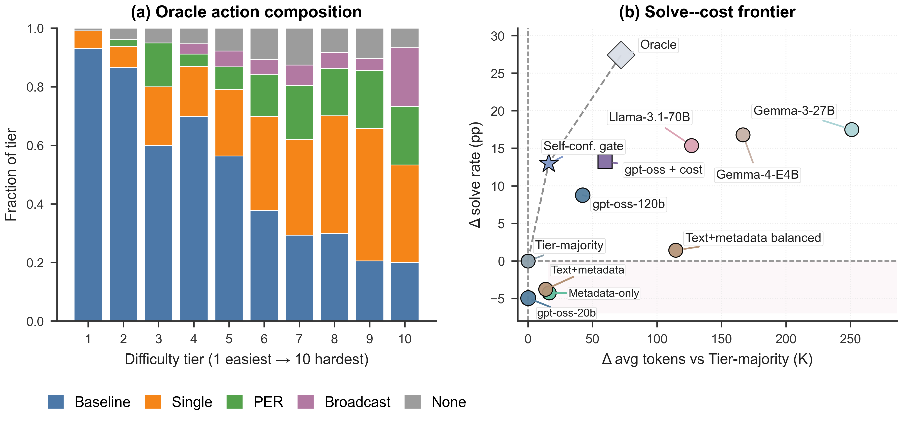

# LLMs Can Predict Failure Risk, But Struggle to Predict Which Collaboration Protocol Pays Off

### Cost-Aware Protocol Routing Across Reasoning Tasks

**EMNLP 2026 Accepted Paper**

[](https://chihhsuan-yang.github.io/EMNLP_Cost-Aware-Protocol-Routing/)
[](https://arxiv.org/abs/2608.14927)
[](https://arxiv.org/pdf/2608.14927)
[](https://huggingface.co/datasets/AgentsSci/EMNLP_Cost-Aware-Protocol-Routing)
[](https://huggingface.co/AgentsSci/EMNLP_Cost-Aware-Protocol-Routing)
[](LICENSE)
[](https://github.com/ChihHsuan-Yang/EMNLP_Cost-Aware-Protocol-Routing/actions/workflows/tests.yml)

Chih-Hsuan Yang¹, Jingyan Jiang¹, Cheng-Hau Yang¹, Vikram Vasudevan², Huihuo Zheng¹, Venkatram Vishwanath¹, Rajeev Thakur¹
¹ Argonne National Laboratory, Lemont, IL, USA  ·  ² Oregon State University, Corvallis, OR, USA

---

Running a language model with more collaboration — self-correction, a
planner-executor-reviewer team, a group of deliberating agents — solves more
problems but costs more tokens. So the practical question is not *"does
collaboration help?"* but ***"for this problem, is more collaboration worth
paying for, and which kind?"*** To study that cleanly we ran **every problem
under all four protocols** with the solver held fixed, which lets us ask what a
router could have known beforehand. We find that a model's own confidence
predicts **whether its first answer will fail** quite well, and predicts **which
collaboration protocol would pay off** quite poorly.



## Key finding

A post-answer, pre-collaboration probe on `gpt-oss-120b` ranks Baseline failures
at **0.8847 AUROC** (4,151 parseable of 4,181; 95% CI [0.8732, 0.8955]). The
*same* score stays useful for "will *any* collaboration help?" (**0.7683 AUPRC**)
but degrades sharply for protocol-specific value — **0.1674 AUPRC** for PER and
**0.1041 AUPRC** for Broadcast.

Confidence can support a first-stage stay-or-escalate decision. **Cost-aware
selection among Single, PER, Broadcast, and None remains unresolved**, and this
artifact is published so others can attack that problem with matched data.

## The four protocols

| Protocol | What it does | Oracle rank |
|---|---|:--:|
| 🟦 **Baseline** | Direct, one-shot solving | 1 |
| 🟧 **Single** | Iterative single-agent self-correction | 2 |
| 🟩 **PER** | Planner–Executor–Reviewer collaboration | 3 |
| 🟪 **Broadcast** | Multi-agent deliberation with independent candidates and sharing | 4 |
| ⬜ *None* | *Not a protocol* — all four observed executions failed | 5 |

The **fixed-order oracle** labels each problem with the first protocol that
actually succeeded, in the order Baseline → Single → PER → Broadcast → None.
It is computed **after** outcomes are known: a retrospective upper bound for
orientation, **not a deployable policy**, and defined over one matched realized
execution per protocol rather than an expectation over repeated runs.

## Six stages, kept separate

Readers often conflate these; the code and data keep them apart.

1. **Protocol execution** — running the four protocols against a model endpoint. *Expensive; needs endpoints.*
2. **Matched outcome construction** — one row per problem holding all four realized outcomes.
3. **Offline oracle labeling** — applying the fixed order to those outcomes.
4. **Router training** — fitting a policy on *features only*, never on outcomes.
5. **Confidence probing** — asking the solver how confident it is, after it answers but before any collaboration.
6. **Scoring and evaluation** — comparing predictions against held-out labels.

**Stages 2–6 are offline and reproduce from this repository.** Stage 1 does not;
see [docs/reproduction.md](docs/reproduction.md).

## 10-minute quickstart

```bash
git clone https://github.com/ChihHsuan-Yang/EMNLP_Cost-Aware-Protocol-Routing.git
cd EMNLP_Cost-Aware-Protocol-Routing
make setup          # create the environment and install the package
make test           # run the test suite (schema, oracle order, leakage, smoke)
make smoke          # tiny end-to-end run on the committed fixture, no download
```

`make smoke` uses only the small fixture in `tests/fixtures/` — no Hugging Face
download, no GPU, no API key, no allocation.

To reproduce the published aggregates from the full released outcomes:

```bash
# 1. download the released per-problem outcomes from Hugging Face
make data

# 2. check what you downloaded (row counts, coverage, checksums)
make validate-data

# 3. regenerate the aggregate tables and diff them against results/aggregate/
#    This exits nonzero on any mismatch.
make reproduce-tables \
  MATCHED_DIR=data/emnlp_protocol_routing/data/matched_labels.csv \
  REFERENCE_DIR=results/aggregate

# 4. regenerate the figures
make reproduce-figures \
  MATCHED_DIR=data/emnlp_protocol_routing/data/matched_labels.csv
```

The quickstart commands (`make setup`, `make test`, `make smoke`) run in CI on every push. The data-dependent commands above require the Hugging Face download and are verified by hand against a fresh clone before each release rather than in CI. See [docs/reproduction.md](docs/reproduction.md)
for what "reproduce" does and does not mean here, and for the numerical
tolerance applied to bootstrap intervals.

## What is released

- **Matched four-protocol outcomes** for all **10 model–condition settings**:
  `{gpt-oss-120b, Gemma-4-31B-it}` × `{OmniMath n=4,181; JEEBench n=515;
  SciBench n=565; LAB-Bench strict n=741; LAB-Bench text-no-tool n=1,542}`.
- **Fixed-order oracle labels** and the code that computes them.
- **Held-out router evaluations** on the **six** settings that have them, on
  identical held-out problem identifiers across routers.
- **Post-answer confidence** probe metrics, parse rates, and the exact probe prompt.
- **PER-versus-Broadcast interaction** analyses, including the conditional
  subsets after Baseline fails and after both Baseline and Single fail.
- The camera-ready **aggregate tables** in [`results/aggregate/`](results/aggregate/).
- The **trained metadata-only router checkpoint** on the Hugging Face model
  repository, with its fitted feature builders, a verified label map, and a
  runnable offline example.
- Protocol configurations, evaluator and probe prompts, and full provenance in
  [`docs/provenance/`](docs/provenance/).

## What is not released

- **Upstream problem text and gold answers.** We release stable identifiers and
  our measured outcomes instead, plus reconstruction instructions and pinned
  upstream revisions. See [`NOTICE`](NOTICE) for each benchmark's license.
- **Foundation model weights.** `gpt-oss-120b` and `Gemma-4-31B-it` are
  third-party models; we did not train them and do not redistribute them.
- **MaScQA.** Excluded from the paper (no matched Gemma run) and from the
  release (its license is NonCommercial).
- **Full raw traces**, which are large; the release is table-first by design.
- **Repeated stochastic runs.** Each problem–protocol pair has one realized outcome.

## Important scope note

Matched four-protocol outcomes cover all **10** settings. The confidence probes,
held-out router evaluations, and interaction analyses cover only the **six**
settings formed by both solvers on OmniMath, LAB-Bench strict, and LAB-Bench
text-no-tool. Please do not read the six-setting conclusions as holding across
all ten.

## Repository layout

```
configs/      protocol, router, and model configurations
src/          the protocol_routing package
scripts/      command-line entry points
tests/        test suite and a tiny committed fixture
results/      camera-ready aggregate tables (the published record)
docs/         schema, protocol definitions, reproduction, limitations, provenance
paper/        the paper PDF and citation
```

## Documentation

- [Protocol definitions](docs/protocol_definitions.md) — every term defined for a first-time reader
- [Data schema](docs/data_schema.md) — every column in every released table
- [Reproduction](docs/reproduction.md) — what reproduces offline, and what does not
- [Limitations](docs/limitations.md) — read before citing a number
- [Provenance](docs/provenance/) — claim-to-artifact map and source inventory

## Citation

```bibtex
@article{yang2026protocolrouting,
  title  = {{LLMs Can Predict Failure Risk, But Struggle to Predict Which
            Collaboration Protocol Pays Off: Cost-Aware Protocol Routing
            Across Reasoning Tasks}},
  author = {Yang, Chih-Hsuan and Jiang, Jingyan and Yang, Cheng-Hau and
            Vasudevan, Vikram and Zheng, Huihuo and Vishwanath, Venkatram and
            Thakur, Rajeev},
  journal = {arXiv preprint arXiv:2608.14927},
  year    = {2026},
  note    = {To appear at EMNLP 2026},
  url     = {https://arxiv.org/abs/2608.14927}
}
```

The official EMNLP 2026 proceedings entry will be added once the proceedings
record exists.

## Acknowledgments

This research used resources of the Argonne Leadership Computing Facility, a
U.S. Department of Energy (DOE) Office of Science user facility at Argonne
National Laboratory (ANL) operated under Contract No. DE-AC02-06CH11357.

We thank the authors of the upstream benchmarks — Omni-MATH, JEEBench, SciBench,
and LAB-Bench — whose work this study measures against. See [`NOTICE`](NOTICE).

## License

Code and documentation in this repository are released under the [MIT License](LICENSE).
Released data tables are our own measurements; upstream benchmark content remains
under its original terms, described in [`NOTICE`](NOTICE).

## Contact

Chih-Hsuan (Bella) Yang — bellayang@anl.gov
